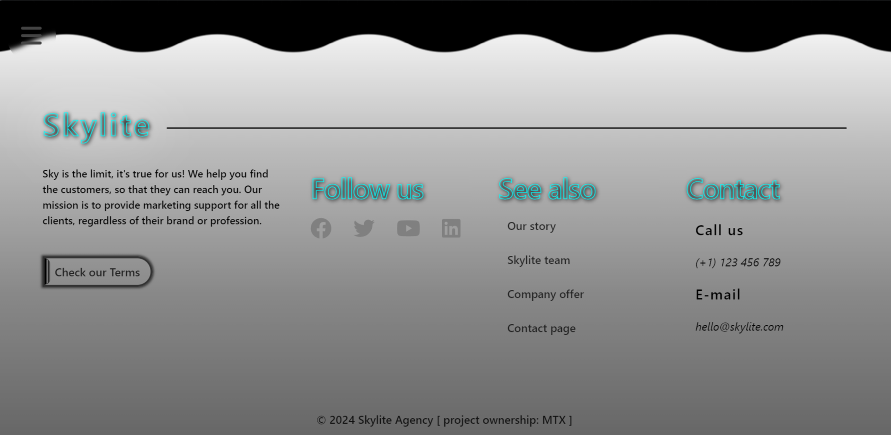

# Skylite

## Table of contents

In order to smoothly jump through the documentation sections, use the "list" icon on the top-left side of the page screen. 

1. [*Introduction*](#introduction)
2. [*History & inspiration*](#history)
3. [*Project overview*](#overview)
4. [*Extra notes*](#notes)
5. [*Future improvements*](#improvements)
6. [*Conclusion*](#conclusion)
7. [*License*](#license)
8. [*Tools used*](#tools)

## Introduction

‘Skylite’ is a web based project of the modern looking, scroll-based website. The site was design with an idea of creating something original, unexpected yet harmonic and eye-pleasant. The main goal behind this project is to deliver high-quality user experience to the visitors, regardless of device they used to access it. To accomplish this effect, many transitions and scroll-based animations were applied across the whole site.

The project is kept within minimalistic style mixed with many large-sized elements and full screen sections. The color palette is purposely limited to mostly shades of black and white colors (with some blue-ish additions) to outline overall harmony of the design. These two colors work very well altogether, and - since they are contrast colors - they assure better accessibility. The typography comes down to one regular font to avoid distraction of any kind.

The content of the website resembles a marketing / PR company site, using some simple terminology and text related to the theme, so that it looks more realistic. This could not be achieved with some ‘Lorem Ipsum’ content nor with unrelated walls of text. **Please note this is not a website of a real-world marketing company, although the desired end result was aimed to be as much authentic as possible.** Want to check it for yourself? Please see https://skylitesite.web.app and give ‘Skylite’ a try!

## History

The project origins come from late September 2023. This time I was willing to create a brand new app, with a little challenging approach to build it with completely different tech stack. I chose to pick software I was not used to, namely Vue, TailwindCSS and GSAP. Those were the tools I have not worked before, and also ones I really wanted to learn. Having just a basic perspective of what those tools are capable of, I started the project development on September 1st, 2023.

The initial plan was to create a piano app, which I quickly dropped for much more appealing idea of designing a website project. Recently, I had discovered many astonishing, beautifully crafted websites participated in Awwwards websites competition. Then I analyzed contents of many nominees as well as daily winners - in order to take note of what make them so great and to revise some resemblances between every of them. Furthermore, surprisingly, I have not reached the finish line building a website ever before. None of my previous trials in the past did succeed. This simply felt as a perfect opportunity to begin with.

The beginnings were rough, to say the least. It was not only because of unfamiliarity with tech stack used (although it still was some sort of disadvantage, but being an aware decision). The major issue was lack of cohesion between newly designed elements. Despite having a general concept for website layout, that felt like not enough. Every single added element was indeed looking fine standalone, but not in composition with other ones - every part of content had its own style. Another concern was scalability of those elements. While some were optimized and seemed simple to integrate further with different screen sizes, others felt completely unmanageable. With those concerns in mind, at that point, the whole project felt like a grand failure. Luckily, the breaking change was soon to come.

Early November 2023 I posted the very first update, which actually introduced scroll based animations to the page. That was a turning point for the project. The animations looked amazing even with inconsistently looking site sections, which were slowly being rebuilt as more and more scroll based animations were added with more confidence. As the project was gradually growing, some extra sections got included, and finally on December 13th, the whole website got completely redesigned with all the elements having the desired look.

The final part was some various adjustments and fixes that were essential to seamlessly prepare the site for production. First off, I have added actual content to the elements, so that they held some informative value and accent the marketing theme of the website. Also, several bugs were addressed with fixes and corrections prepared, and so the very last thing remaining was media queries. After almost 2 weeks of careful site tailoring for different screen sizes, the final product was ready to be published. The development journey has reached the finish line on January 15th, 2024 and the project being continously updated ever since. 

The current state of the project can be seen live:  https://skylitesite.web.app

## Overview

As mentioned above, the whole project is a website and not an actual app. Because of that, instead of providing some guidelines, this subsection contains some site screenshots to give you some insight of the project overall look, design style and character. All screenshots come from a large screen device (laptop). **Note below screenshots represent the website state as of January 31st, 2024 and might become obsolete in the future.**

 

1) Initial Landing Page screen

 

 

 

2) Team Showcase profile

 

 

 

3) Collaboration guidelines

 

 

 

4) Website footer

 

 

 

 

## Notes

 **Here I would like to address some ambiguities that may arise because of unique nature of the project:**

 ***Not mobile-first this time*** - It is more of technical aspect, but yeah, this is **not a mobile-first project** and for a good reason. This website project contains plenty of scroll-based animations, which play crucial role in the overall design. While desktops handle them very well, mobile devices can not (because of performance issues). Therefore, the main focus here was on huge screen devices for more dynamic version, nontheless with more harmonic mobile experience to ensure stable performance and decent user experience.  

 ***Site authenticity*** - Despite how realistic the website may feel, in fact this is just a showcase project. Any similarities of people images, names, surnames are completely coincidential. That is true especially for Employees and Reviews sections, where all the images are one and only AI-generated content across the website. Furthermore, company contact details, presented mainly in the Footer secion, **are not** real aswell. The exact same note applies to all the other text contained in this project.

 ***Site images ownership*** - Every text element and almost every image contained within the website does belong to the project author. List of all the exceptions can be found right below - all the credits goes to their respective authors. If you want to use any of the image **not covered** in the list, please contact me first in that regard.

- Main background hero section   https://unsplash.com/photos/people-sitting-down-near-table-with-assorted-laptop-computers-SYTO3xs06fU
- Company introduction (slide 1) https://unsplash.com/photos/people-seated-in-living-room-wVh5grSMYaY
- Company introduction (slide 2) https://unsplash.com/photos/printed-sticky-notes-glued-on-board-zoCDWPuiRuA
- Company introduction (slide 3) https://unsplash.com/photos/woman-placing-sticky-notes-on-wall-Oalh2MojUuk

## Improvements

The current state of ‘Skylite’ project seems quite stable for now. However, there are actually a few possibilities to make the site feel even better: 

🎯 Several landing page elements might be adjusted in a way that would better fit different screen ratios. A good example of that is the collaboration slider, where slides on certain screen sizes feels ‘stretchy’ and on some others are going beyond the visible viewport during vertical scrolling. Also improving some existing effects / animations might be a good choice here.

🎯 In the future, some more currently inactive website subpages might be added. Currently, by clicking on the ‘Story’, ‘Team’, ‘Offer’ and ‘Contact’ links, there is a prompt message, and redirect behaviour is prevented. Those subpages would probably not be as much verbose as the Landing Page is. In fact, it might be more beneficial to put some extra effort on quality rather than quantity. To make it happen, I need to further explore the capabilities of GSAP, as well as some other technologies to make those subpages really stand out.   

## Conclusion

Thank you for checking out ‘Skylite’ documentation page!

Despite some tough moments at early stages in development stage, working on the project was an absolutely amazing experience. This project involved using a lot of tools, some of which were completely new for me, and that was a real challenge to tackle! But **sky is the limit**. If you try hard enough, everything is possible!

I highly encourage you to take a look at this website if you have not already. Also, make sure to see the project changelog so that you do not miss any recent updates.

**Happy scrolling!**

## License

This project has been made under MIT License. Follow this link for it's detailed content: 

https://github.com/Martimex/Skylite/blob/main/LICENSE

## Tools

 - [Node JS (runtime)](https://github.com/nodejs/node)
 - [Vue (JS framework)](https://github.com/vuejs/vue)
 - [Vite (build tool)](https://github.com/vitejs/vite)
 - [Typescript (language)](https://github.com/microsoft/TypeScript)
 - [GSAP (animation platform)](https://github.com/greensock/GSAP)
 - [Lenis (smooth scroll library)](https://github.com/studio-freight/lenis)
 - [Tailwind (CSS framework)](https://github.com/tailwindlabs/tailwindcss)
 - [Font Awesome (icons)](https://github.com/FortAwesome/Font-Awesome)
 - [Hero patterns (svg backgrounds)](https://heropatterns.com/)
 - [Dreamerland AI (AI images)](https://app.dreamerland.ai)
 - [Unsplash (stock photos)](https://unsplash.com)
 - [Firebase (hosting provider)](https://firebase.google.com)
  

© Martimex 2024

